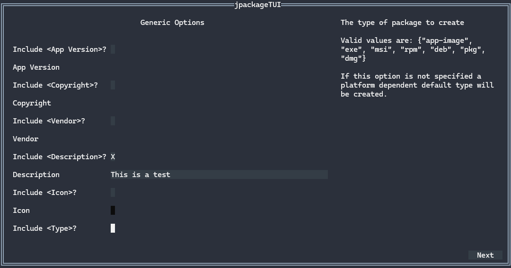

<div align="center">

[](#jpackageTUI)

</div>

# jpackageTUI

jpackageTUI is a Textual User Interface (TUI) designed to simplify the usage of the jpackage tool for
exporting Java projects. The tool is currently in its early development phase, providing basic
functionality to streamline simple tasks.

---


## Installation
You can install it by either [building](#building) it yourself or downloading the latest release.

## Usage

Run the jpackageTUI executable file by typing:
```bash
.\jpackageTUI.exe
```

### Requirements

* jpackage must be installed and properly configured in the system's PATH.

### ⌨️ Keybindings

| Keybinding      | Description                              |
|-----------------|------------------------------------------|
| `esc`           | Quit the program / Quit file selection   |
| `tab`           | Move to the next input field             |
| `shift` + `tab` | Move to the previous input field         |
| `enter`         | Select                                   |
| `down arrow`    | Move down in a dropdown/tree/list field  |
| `up arrow`      | Move up in a dropdown/tree/list field    |
| `right arrow`   | Move to the next file selector field     |
| `left arrow`    | Move to the previous file selector field |

Note: Fields can also be interacted with using the mouse.

### ⚙️ Arguments

```bash
.\jpackageTUI.exe [options]
```

| Option             | Description                              |
|--------------------|------------------------------------------|
| `--force` / `-f`   | Skips the check if jpackage is installed |
| `--verbose` / `-v` | Adds all jpackage Options to the  Form   |

### 🖥️ Example Output

Below is a sample of what the TUI looks like when running:

[](#Installation)

### 🚧 Known Limitations

Currently, jpackageTUI supports only a subset of the `jpackage` options:

---

## 🛠️ Building

### Requirements

* Git
* Go 1.24 or later

### System Requirements

* Windows (tested on Windows 11)
* MacOS (Tested on MacOS Sequoia 15.5)

### Instructions

1. Clone the repository :
    ```bash
    git clone https://github.com/Suchti18/jpackageTUI.git
    ```
2. Change into the repository folder:
    ```bash
    cd jpackageTUI
    ```
3. Build the project:
    ```bash
    go build .\cmd\jpackageTUI\
    ```
   
After running `go build`, an executable file will be generated in the project folder.

---

## 🤖 AI Disclaimer

AI helped in following areas:
* Debugging
* README creation

---

## 🔗 Additional Resources
- [jpackage Documentation](https://docs.oracle.com/en/java/javase/17/docs/specs/man/jpackage.html)

---

## 📜 License

[Unlicense](https://unlicense.org)